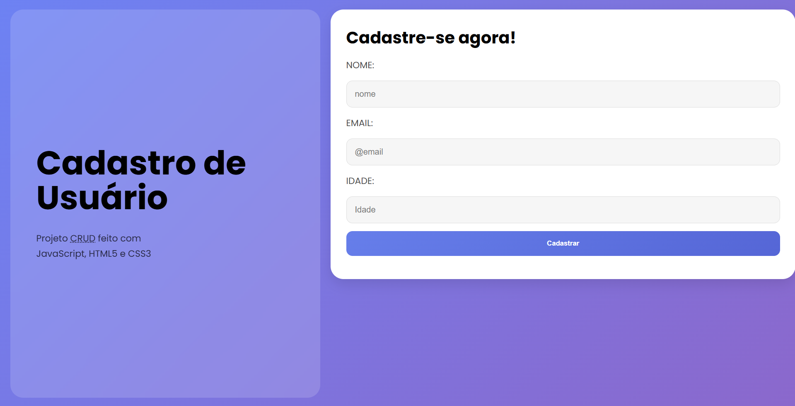

# 📋 Sistema de Cadastro de Usuários (CRUD)

## 🚧 Projeto em desenvolvimento

Este projeto consiste em um **sistema de gerenciamento de usuários (CRUD)** desenvolvido utilizando **JavaScript puro (Vanilla JS)**, com manipulação direta do **DOM** e persistência de dados utilizando **LocalStorage**.

O objetivo principal foi praticar conceitos fundamentais de desenvolvimento web, como manipulação de elementos, eventos, estrutura de dados e organização de lógica em JavaScript.

---

# 📸 Demonstração

Adicione aqui um print da interface do projeto.

---

# 🚀 Funcionalidades

O sistema permite:

- ✅ **Cadastrar usuários**
- 📄 **Listar usuários cadastrados**
- ✏️ **Editar informações de usuários**
- ❌ **Remover usuários**
- 💾 **Persistência de dados com LocalStorage**
- ⚠️ **Validação de campos do formulário**
- 🪟 **Modal para edição de registros**
- 🔄 **Renderização dinâmica da lista de usuários**

Todos os dados permanecem salvos no navegador mesmo após recarregar a página.

---

# 🛠️ Tecnologias utilizadas

Este projeto foi desenvolvido utilizando:

- **HTML5**
- **CSS3**
- **JavaScript (Vanilla JS)**
- **LocalStorage (Web API)**

Sem utilização de frameworks ou bibliotecas externas.

---

# 🧠 Conceitos praticados

Durante o desenvolvimento foram praticados diversos conceitos importantes de JavaScript:

- Manipulação do **DOM**
- **EventListeners**
- Estruturas condicionais (`if / else`)
- Manipulação de **arrays**
- Métodos importantes:
  - `push()`
  - `splice()`
  - `forEach()`
- Uso do **LocalStorage**
- Criação dinâmica de elementos com:
  - `createElement()`
  - `appendChild()`
- Controle de estado da interface
- Implementação de **modal de edição**
- Atualização dinâmica da interface

---

# 📂 Estrutura do projeto
📦 cadastro-usuarios
┣ 📂 css
┃ ┗ style.css
┣ 📂 js
┃ ┗ script.js
┣ 📄 index.html
┗ 📄 README.md

---

# 🌐 Deploy

O projeto pode ser acessado online através da Vercel: https://crud-no-java-script.vercel.app/

---

# 🎯 Objetivo do projeto

Este projeto foi desenvolvido com fins **educacionais**, com o objetivo de consolidar conhecimentos adquiridos após o estudo inicial de **JavaScript**.

A proposta foi construir um **CRUD completo utilizando apenas JavaScript puro**, simulando o funcionamento de aplicações reais de gerenciamento de dados.

---

# 🔮 Melhorias futuras

Possíveis melhorias para versões futuras do projeto:

- Melhor validação de e-mail
- Confirmação antes de remover usuários
- Animações no modal de edição
- Melhor responsividade
- Uso de **ID único para cada usuário**
- Integração com **backend ou API**

---

# 👨‍💻 Autor

Desenvolvido por **Eduardo Henrique**

Estudante de programação focado em **desenvolvimento web**.
